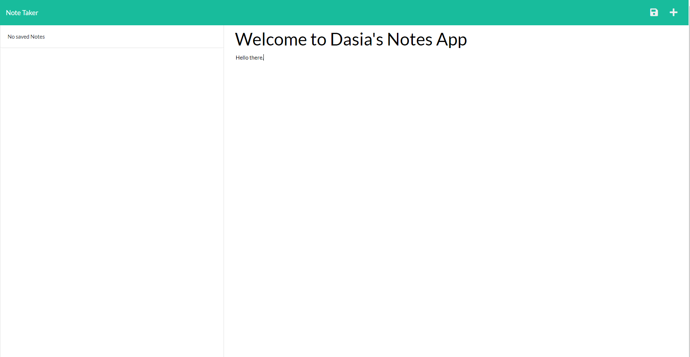

# Note Taker
  
      https://opensource.org/licenses/MIT

  ## Description

  This application utilizes Express.js as well as Node.js to save and retrieve note data from a JSON files to write and save user notes.
  The deployed application can be found 

  ## Table of Contents

  * [Installation](#installation)

  * [Usage](#usage)

  * [License](#License)

  * [Contributing](#contributing)

  * [Tests](#tests)

  * [Questions](#Questions)

  ## Installation
  
  To install necessary dependencies run the following command:

  ```
  npm i
  ```

  ## Usage

  Confirm all dependencies such as express and uuid are installed prior to running and application is ran on the local server.

  The following images show the web application's appearance and functionality:

  

  

  ## License

  This project is licensed under the MIT license.

  ## Contributing

  

  ## Tests

  To run tests, run the following command:

  ```
  
  ```

  ## Questions

  If you have any questions about the repo, open an issue or contact me directly at dasiasmith023@gmail.com. You can find more of my work
  at .

